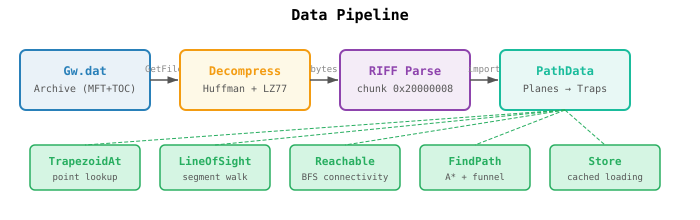
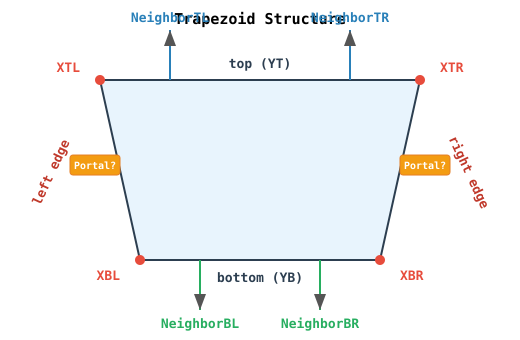
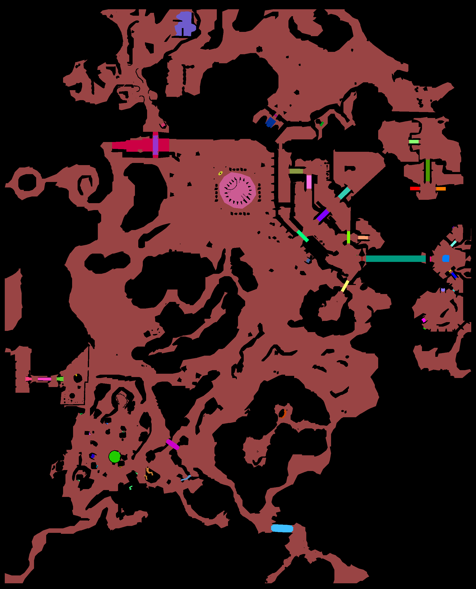
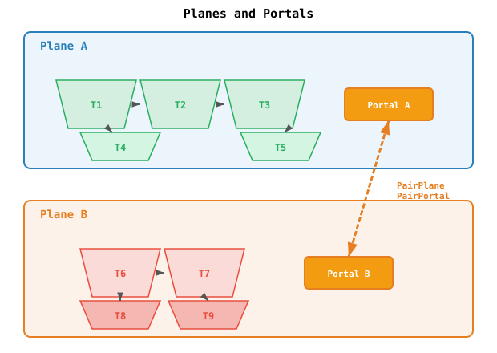
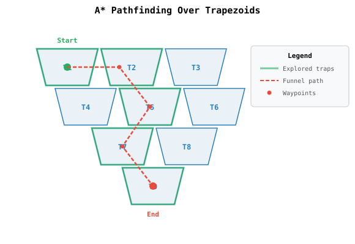

# Pathing System

The pathing system provides navmesh-based spatial queries for the game server. It reads Guild Wars' proprietary `Gw.dat` archives, extracts trapezoid-based navigation meshes, and exposes point lookups, line-of-sight checks, reachability tests, and A\* pathfinding.

---

## Overview

<p align="left">
  
</p>

---

## The Trapezoid Navmesh

Guild Wars represents walkable terrain as a mesh of **trapezoids** — quadrilaterals with horizontal top/bottom edges and sloped left/right sides. Each trapezoid is a convex, fully-walkable region.

<p align="left">
  
</p>

Each trapezoid stores:

| Field       | Type      | Description                                        |
|-------------|-----------|----------------------------------------------------|
| `TrapID`    | `uint32`  | Globally unique ID across all planes               |
| `NeighborTL`| `int`     | Top-left neighbor index (-1 = wall)                 |
| `NeighborTR`| `int`     | Top-right neighbor index (-1 = wall)                |
| `NeighborBL`| `int`     | Bottom-left neighbor index (-1 = wall)              |
| `NeighborBR`| `int`     | Bottom-right neighbor index (-1 = wall)             |
| `PortalLeft`| `uint16`  | Portal index on left edge (`0xFFFF` = none)         |
| `PortalRight`| `uint16` | Portal index on right edge (`0xFFFF` = none)        |
| `YT`, `YB`  | `float32` | Top and bottom Y coordinates                       |
| `XTL`, `XTR`| `float32` | Top-left and top-right X coordinates                |
| `XBL`, `XBR`| `float32` | Bottom-left and bottom-right X coordinates          |

**Connectivity rules:**
- Trapezoids connect to neighbors **only** through their top and bottom edges (TL, TR, BL, BR).
- Left and right edges are always **walls** or **portals** to other planes.
- This creates a directed acyclic graph suitable for efficient pathfinding.

### Example: Ascalon (Pre-Searing) — Map `0x1b97d`

<p align="left">
  
</p>

The trapezoid mesh rendered for the Ascalon area (pre-searing). Walkable terrain is shown in brown; black is unwalkable. The colored strips are **portals** connecting different planes — each unique color marks a portal pair linking trapezoids across elevation changes and zone transitions. The large pink circle near the center is a dense cluster of trapezoids around a point of interest.

---

## Planes and Portals

A single map may contain multiple **planes** — independent walkable surfaces representing different elevations, disconnected areas, or instanced regions.

<p align="left">
  
</p>

**Portals** are gates connecting trapezoids across planes. Each portal has a twin on the destination plane (bidirectional pairing resolved at load time). The pathfinder follows portal pairs to traverse between planes, costing Euclidean distance through the crossing point.

| Portal Field     | Description                                              |
|------------------|----------------------------------------------------------|
| `PortalPlaneID`  | Plane this portal belongs to                              |
| `NeighborPlaneID`| Plane on the other side                                   |
| `Flags`          | `0x4` = blocked (impassable)                              |
| `Traps`          | Trapezoids on this side that touch the portal             |
| `PairPlane`      | Index of the destination plane in `PathData.Planes`      |
| `PairPortal`     | Index of the twin portal in the destination plane         |

---

## Node Types (BSP Tree)

Each plane contains a **Binary Space Partition** tree used for spatial subdivision. Nodes come in three types:

```
         XNode (split along a line)
        /                          \
   YNode (split along Y)        Sink (leaf → trapezoid)
   /         \                      │
 Sink       Sink              ┌─────┴─────┐
  │          │                │ Trapezoid │
┌─┴─┐    ┌───┴──┐             └───────────┘
│ T │    │  T   │
└───┘    └──────┘
```

| Node Type | Description                                         | Children     |
|-----------|-----------------------------------------------------|--------------|
| `XNode`   | Splits space along an arbitrary line (directional)  | `Left/Right` |
| `YNode`   | Splits space along a horizontal Y value             | `Above/Below`|
| `Sink`    | Leaf node referencing a single trapezoid            | `Trap` index |

> **Note:** The BSP tree is parsed from the game data and stored, but the A\* pathfinder operates directly on trapezoid neighbor links, not on the BSP tree.

---

## Pathfinding (A\*)

The pathfinder uses **A\* search** over the trapezoid neighbor graph. It finds paths across planes via portal traversal and produces smoothed waypoints using a **funnel algorithm**.

### Algorithm

```
FindPath(source, destination):
    1. Locate source and destination trapezoids via TrapezoidAt
    2. If same trapezoid → return single waypoint
    3. Push source trapezoid into priority queue (cost = 0)
    4. While queue not empty:
        a. Pop trapezoid with lowest f = g + h
        b. For each neighbor (TL, TR, BL, BR):
           - Compute crossing point on shared edge
           - g(current) + euclidean_dist(crossing) → new cost
           - h = heuristic distance to destination
           - If better than known cost, update and push
        c. For each portal (left, right edges):
           - Skip blocked portals (flag 0x4)
           - Follow PairPlane/PairPortal to destination plane
           - Expand trapezoids on the other side
        d. If destination trapezoid popped → backtrack and build path
    5. Smooth raw trapezoid centers with funnel algorithm → waypoints
    6. Return waypoint list
```

### Cost Model

| Component | Formula                                                |
|-----------|--------------------------------------------------------|
| `g` (actual) | Euclidean distance from current point to edge crossing |
| `h` (heuristic) | Minimum distance from crossing to destination      |
| Max cost  | `10000.0` — paths exceeding this are abandoned        |

### Waypoint Smoothing

Raw A\* produces trapezoid-center waypoints. A **funnel algorithm** narrows the path into tight corridors:

<p align="left">
  
</p>

The funnel maintains left/right bounds and collapses to the narrowest point at each trapezoid transition, producing natural-looking paths.

### Waypoint Structure

```go
type Waypoint struct {
    X, Y   float32  // world coordinates
    Plane  int      // plane index
    TrapID uint32   // trapezoid containing this point
}
```

---

## Spatial Queries

### TrapezoidAt(x, y, plane)

Finds which trapezoid contains a given point. Uses a **uniform spatial grid** for planes with ≥ 16 trapezoids (bucket count = `sqrt(N)`, clamped to 8–128), falling back to linear scan for smaller planes.

### LineOfSight(x1, y1, x2, y2, plane)

Walks a line segment through the trapezoid mesh:
1. Find start/end trapezoids
2. At each step, ray-segment intersect the current trapezoid's 4 edges
3. Cross into the neighbor across the exit edge
4. Repeat until end trapezoid is reached or no advancement possible

Bounded to `len(Trapezoids)` iterations to prevent infinite loops on degenerate geometry.

### Reachable(x1, y1, fromPlane, x2, y2, toPlane)

BFS over the walkable graph (neighbors + unblocked portals). Pure connectivity test — no distance optimization. Portals with flag `0x4` are impassable.

---

## Data Pipeline

The pathing data flows through three distinct stages:

### 1. Archive Reading (`archive.go`)

The `Gw.dat` file is a custom archive format with a Master File Table (MFT) and Table of Contents (TOC).

| Component    | Size     | Description                                    |
|--------------|----------|------------------------------------------------|
| Header       | 32 bytes | Magic (`0x1A4E4133`), block size, MFT offset  |
| MFT Header   | 24 bytes | Entry count, sizes                             |
| MFT Entry    | 24 bytes | Offset, size, compression flag, checksum       |
| TOC Entry    | 8 bytes  | File ID → MFT index mapping                    |

Files are looked up by ID via the TOC hash map, then read from the MFT entry's offset.

### 2. Decompression (`decompress.go`)

Compressed files (flag `8`) use a custom **Huffman + LZ77** scheme:
- Huffman trees for literal/length/distance codes
- LZ77 back-reference copies
- Operates on uint32 words with wraparound arithmetic

### 3. RIFF Import (`import.go`)

Map files use a **RIFF container** (signature `ffna`). The path data lives in chunk ID `0x20000008`:

| Tag | Content                     |
|-----|-----------------------------|
| 0   | Plane header (counts)       |
| 1   | Vec2f position vectors      |
| 2   | Trapezoid geometry           |
| 3   | Root node type               |
| 4   | XNodes                       |
| 5   | YNodes                       |
| 6   | Sinks                        |
| 9   | Portal definitions           |
| 10  | Portal trapezoid indices     |

Portals are paired across planes using a composite key `(planeID << 16) | neighborSharedID`.

---

## Store and Caching

The `Store` manages loaded `PathData` with thread-safe access:

```go
type Store struct {
    mu      sync.RWMutex
    archive *Archive
    data    map[uint32]*PathData   // file ID → parsed navmesh
    failed  map[uint32]error       // permanently failed IDs
}
```

| Method              | Description                                           |
|---------------------|-------------------------------------------------------|
| `NewLazyStore(path)`| Opens archive, loads maps on demand                   |
| `EnsureLoaded(id)`  | Loads + caches a map if not already loaded             |
| `PathDataForFileID` | Returns cached data (no load trigger)                  |
| `Set(id, data)`     | Manually inject data (for tests)                       |

Loaded `PathData` is **immutable after creation** and shared read-only across all instances referencing the same map. Failed loads are cached permanently to avoid retrying corrupt files.

---

## File Index

| File            | Purpose                                              |
|-----------------|------------------------------------------------------|
| `mapdata.go`    | Core types: `Vec2f`, `Trapezoid`, `Node`, `Portal`, `Plane`, `PathData` |
| `archive.go`    | Gw.dat archive reader: MFT/TOC parsing, file extraction |
| `decompress.go` | Custom Huffman+LZ77 decompression                    |
| `import.go`     | RIFF parser + navmesh importer                       |
| `query.go`      | `TrapezoidAt`, `LineOfSight`, `Reachable`, spatial grid |
| `pathfind.go`   | A\* pathfinder, funnel waypoint builder              |
| `loader.go`     | Thread-safe `Store` with lazy loading                 |

---

## Key Constants

| Name              | Value       | Description                                |
|-------------------|-------------|--------------------------------------------|
| `trapTol`         | `1.0`       | Tolerance for point-in-trapezoid checks    |
| `entryTol`        | `1e-2`      | Tolerance for near-point detection in LOS  |
| `maxCost`         | `10000.0`   | Maximum path cost before abandonment       |
| `maxLoop`         | `3000`      | Max funnel iterations during path build    |
| `noPortal`        | `0xFFFF`    | Sentinel for absent portal reference       |
| Portal flag `0x4` | —           | Marks a portal as blocked/impassable       |
